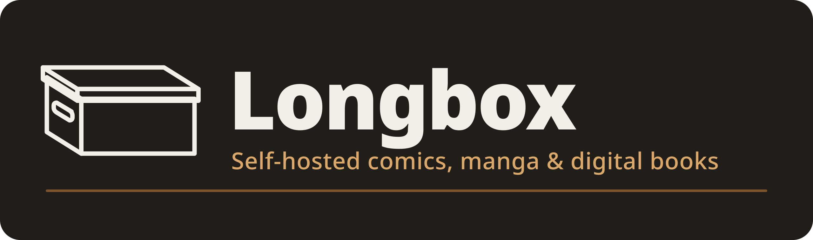

<p align="center">
  
</p>

<p align="center">
  <a href="https://github.com/SaintedRogue/longbox/blob/main/LICENSE"></a>
  <a href="https://github.com/SaintedRogue/longbox/stargazers"></a>
  <a href="https://github.com/SaintedRogue/longbox/commits/main"></a>
  
  
  
</p>

<p align="center">
  <b>Your comics, bagged, boarded, and served.</b><br/>
  A fast, self-hosted longbox for every issue you own — comics, manga, and digital books — with a Rust core, an installable web app, and full <a href="https://opds.io/">OPDS</a> support. A PWA-first fork of <a href="https://github.com/stumpapp/stump">Stump</a>.
</p>

<p align="center">
  
</p>

<!-- prettier-ignore -->
<details>
  <summary><b>Table of Contents</b></summary>

- [What is Longbox?](#what-is-longbox)
- [What's in this box that Stump's isn't](#whats-in-this-box-that-stumps-isnt)
- [What's inside](#whats-inside)
- [Cracking the box open](#cracking-the-box-open)
- [For the shop out back (developers)](#for-the-shop-out-back-developers)
- [How the box is packed](#how-the-box-is-packed)
- [If this box isn't for you](#if-this-box-isnt-for-you)
- [License & Attribution](#license--attribution)

</details>

## What is Longbox?

Longbox is a free, open-source media server for the comics, manga, and books you
already own. Point it at your files and it does what a good collector does:
scans the shelf, reads the metadata off every issue, and serves the whole run to
a fast built-in reader, to any [OPDS](https://opds.io/) client, and to your
e-ink device — all from a single self-hosted binary. No cloud landlord, no
subscription, no one else's server. Your box, your rules.

Under the hood it's [Rust](https://www.rust-lang.org/) +
[Axum](https://github.com/tokio-rs/axum) + [SeaORM](https://www.sea-ql.org/SeaORM/)
doing the scanning and serving, with a [React](https://react.dev/) app up front.

Longbox began as a fork of [Stump](https://github.com/stumpapp/stump) by Aaron
Leopold, whose excellent Rust core and fast scanner we kept and built on. Where
Stump ships desktop and mobile apps alongside the web UI, **Longbox goes all-in
on a single installable PWA** — and spends that focus on navigation, comic
metadata, and offline reading.

— · — · —

## What's in this box that Stump's isn't

The things Longbox adds on top of the Stump core:

- **🗂️ One longbox, everywhere.** The Tauri desktop and Expo mobile apps are
  gone — a single installable, offline-capable PWA covers desktop and mobile.
  Dropping the native apps also makes the whole repository uniformly
  [MIT](./LICENSE).
- **🧭 Navigation that keeps your place.** Scroll position is restored on
  back/forward, book details open as a **peek overlay** over the browse grid (the
  "pulled issue" — you never lose your spot on the shelf), and breadcrumbs plus
  back/forward controls make it easy to find your way home. _(See
  [`docs/adr/0001`](./docs/adr/0001-router-and-scroll-restoration.md).)_
- **🏷️ Deeper comic metadata.** A [Metron](https://metron.cloud) provider brings
  CC BY-SA metadata and ComicVine/GCD cross-references into the enrichment
  framework, ComicVine IDs are recovered from ComicTagger/Kavita tags
  (`[Issue ID N]` and `[CVDB N]`), and edits can be written **back to
  `ComicInfo.xml`** inside the archive (opt-in, CBZ).
- **📥 Bagged & boarded offline reading.** Reading progress made offline is
  queued locally (IndexedDB) and synced automatically on reconnect, so a dropped
  connection never loses your place. Full offline downloads are
  [on the pull list](./docs/longbox-wave3b-offline-plan.md).
- **📱 Proper installability.** Maskable icons, a full iOS launch-screen set, and
  a themed splash — Longbox installs and launches like a native app.
- **📦 A fresh identity.** A hand-drawn line-mark and brand system (see
  [`docs/longbox-design-notes.md`](./docs/longbox-design-notes.md)).

## What's inside

Inherited from the Stump core and carried forward:

- [OPDS](https://opds.io/) [v1.2](https://specs.opds.io/opds-1.2) (including
  [OPDS PSE](https://github.com/anansi-project/opds-pse)) and
  [v2.0](https://specs.opds.io/opds-2.0.html)
- EPUB, PDF, CBZ/ZIP, and CBR/RAR — with a built-in reader for every format
- Annotations and highlights for EPUB
- OIDC authentication and multi-user accounts with permissions, age
  restrictions, and access control
- [Kobo](/docs/content/docs/guides/integrations/kobo.mdx) and
  [KoReader](/docs/content/docs/guides/integrations/koreader.mdx) sync
- A handful of [built-in themes](/docs/content/docs/apps/web/themes.mdx) (light,
  dark, and more)
- 32 locales
- Multiple installation methods, including Docker and pre-built binaries

The [documentation](/docs/content/docs) has the full run.

## Cracking the box open

Installation guides live in
[the docs](/docs/content/docs/getting-started/installation/index.mdx) (Docker and
pre-built binaries).

To crack it open locally for development:

```bash
yarn install          # install JS deps
yarn web build        # build the web app once
cargo run -p longbox_server   # run the server (serves the built web app)
# or, for hot-reloading the web UI:
yarn dev:web
```

## For the shop out back (developers)

The developer guide is in
[the docs](/docs/content/docs/developer/contributing.mdx); please review
[CONTRIBUTING.md](./.github/CONTRIBUTING.md) first.

Contributions are very welcome — good places to start:

- **UI/UX** — even small polish goes a long way
- **Tests** — broader coverage, especially around metadata and readers
- **Translations** — help expand and fix locale coverage
- **CI / release automation** and other devops
- Chipping away at `TODO`/`FIXME` comments

Take a look at the [open issues](https://github.com/SaintedRogue/longbox/issues)
to see what's on the pull list.

## How the box is packed

Managed with yarn workspaces + cargo workspaces:

```bash
apps/
  server/   # Axum server (also serves the web app)
  web/      # installable React PWA
core/       # file processing, scanning, metadata internals
crates/     # supporting Rust crates
  migrations/  models/  graphql/  integrations/  ...
packages/   # shared TypeScript packages (browser UI, sdk, components, i18n, ...)
docs/       # documentation + design notes, ADRs, and plans
```

## If this box isn't for you

Longbox is far from the only server in this space. If it isn't your fit, these
are worth a look:

- [Kavita](https://github.com/Kareadita/Kavita)
- [Komga](https://github.com/gotson/komga)
- [Codex](https://github.com/ajslater/codex)
- [Storyteller](https://gitlab.com/storyteller-platform/storyteller)
- [audiobookshelf](https://github.com/advplyr/audiobookshelf) (_audiobooks & podcasts_)

## License & Attribution

All code in this repository is licensed under the [MIT License](https://www.tldrlegal.com/license/mit-license).

Longbox is a fork of [**Stump**](https://github.com/stumpapp/stump) by Aaron Leopold and contributors — thank you for the Rust core and fast scanner this project is built on.
