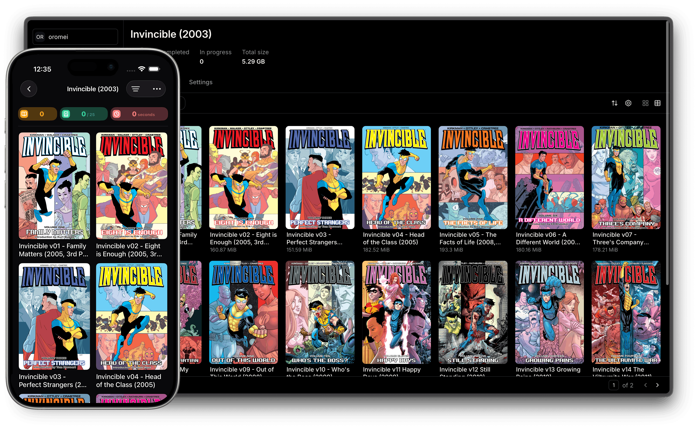

<p align="center">
  
</p>
<h1 align="center">Longbox</h1>

<p align="center">
  <a href="https://github.com/SaintedRogue/longbox/blob/main/LICENSE">
    
  </a>
</p>

<p align='center'>

Longbox is a free and open source comics, manga, and digital book server with OPDS support, created with <a href="https://www.rust-lang.org/">Rust</a>, <a href='https://github.com/tokio-rs/axum'>Axum</a>, <a href='https://www.sea-ql.org/SeaORM/'>SeaORM</a> and <a href='https://reactjs.org/'>React</a>. It is a fork of <a href="https://github.com/stumpapp/stump">Stump</a> by Aaron Leopold.

</p>

<p align='center'>

</p>

<!-- prettier-ignore: I hate you sometimes prettier -->
<details>
  <summary><b>Table of Contents</b></summary>
  <p>

- [Disclaimer](#disclaimer)
- [Features](#features)
- [Roadmap](#roadmap)
- [Getting Started](#getting-started)
- [Developer Guide](#developer-guide)
  - [Contributing](#contributing)
- [Repository Structure](#repository-structure)
- [Similar Projects](#similar-projects)
- [License](#license)
- [Attribution](#attribution)
</details>

## Disclaimer

Longbox is under active development and should be treated as **beta software** until it reaches a stable `1.0` release. I do my best to avoid breaking changes, or changes which might cause data loss, but there are no guarantees.

I develop and maintain Longbox in my free time. In other words, this is not my job and there is no guarantee of any timeline for features or bug fixes.

## Features

- [OPDS](https://opds.io/) [v1.2](https://specs.opds.io/opds-1.2) (including [OPDS PSE](https://github.com/anansi-project/opds-pse)) and [v2.0](https://specs.opds.io/opds-2.0.html) support
- EPUB, PDF, CBZ/ZIP, and CBR/RAR support
- Built-in readers for all supported formats
- Annotations and highlights for EPUB books
- OIDC authentication
- Translations (32 locales inherited from upstream)
- Multi-user account management with permissions, age restrictions, and other access control features
- Theming support with a handful of [built-in themes](/docs/content/docs/apps/web/themes.mdx)
- [Kobo](/docs/content/docs/guides/integrations/kobo.mdx) and [KoReader](/docs/content/docs/guides/integrations/koreader.mdx) sync integrations
- Multiple different installation methods, including Docker and pre-built binaries

And more not mentioned. The [documentation](/docs/content/docs) provides additional details about features, installation, and usage guides.

## Roadmap

You can track [open issues](https://github.com/SaintedRogue/longbox/issues) to see what efforts are currently being worked on or planned.

Feel free to create an issue or discussion if you have anything else you'd like to see!

## Getting Started

The installation guides are available in [the docs](/docs/content/docs/getting-started/installation/index.mdx).

## Developer Guide

The developer guide is available in [the docs](/docs/content/docs/developer/contributing.mdx).

### Contributing

Contributions are very **welcome**! Please review the [CONTRIBUTING.md](./.github/CONTRIBUTING.md) before getting started.

I recommend taking a look at [open issues](https://github.com/SaintedRogue/longbox/issues).

In general, the following areas could always use help:

- Translations, so Longbox is accessible to as many people as possible
  - Help find/fix areas of the app that need better translation coverage
- Writing comprehensive tests
- Improving the UI/UX, even small changes can go a long way
- CI pipelines, automated release processes, and other devops-related efforts
- Addressing `TODO` or `FIXME` comments in the codebase

## Repository Structure

The repository is managed via yarn workspaces and cargo workspaces:

```bash
# The primary applications all grouped together
apps/
  server/    # Axum server
  web/       # UI served by the server
# The primary internals, like file processing etc
core/
# Supporting Rust crates (cli, graphql, integrations, etc)
crates/
  migrations/  # Database migrations
  models/      # Database models
docs/
# Shared TypeScript packages
packages/
```

## Similar Projects

There are a number of other projects that are similar to Longbox, it certainly isn't the first or only digital book media server out there. If Longbox isn't for you, or you want to check out similar projects in this space, here are some other projects you might be interested in:

- [audiobookshelf](https://github.com/advplyr/audiobookshelf) (_Audiobooks, Podcasts_)
- [Codex](https://github.com/ajslater/codex)
- [Kavita](https://github.com/Kareadita/Kavita)
- [Komga](https://github.com/gotson/komga)
- [Storyteller](https://gitlab.com/storyteller-platform/storyteller)

## License

All code in the repository is licensed under the [MIT License](https://www.tldrlegal.com/license/mit-license).

## Attribution

- Longbox is a fork of [Stump](https://github.com/stumpapp/stump) by Aaron Leopold and contributors.
