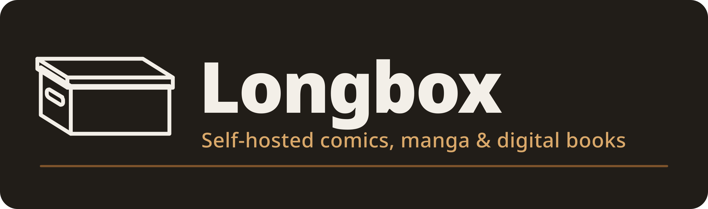
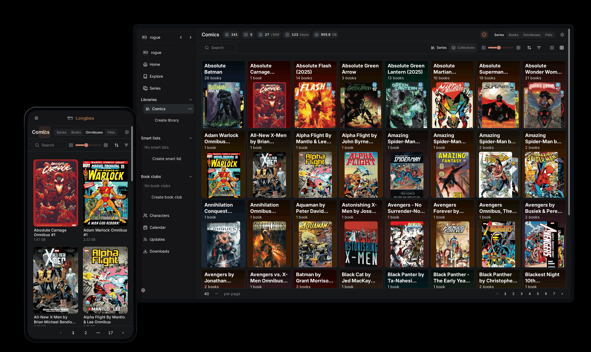

<p align="center">
  
</p>

<p align="center">
  <a href="https://github.com/SaintedRogue/longbox/blob/main/LICENSE"></a>
  <a href="https://github.com/SaintedRogue/longbox/stargazers"></a>
  <a href="https://github.com/SaintedRogue/longbox/commits/main"></a>
  
  
  
</p>

<p align="center">
  <b>Your comics, bagged, boarded, and served.</b><br/>
  A fast, self-hosted longbox for every issue you own — comics, manga, and digital books — with a Rust core, an installable web app, and full <a href="https://opds.io/">OPDS</a> support.
</p>

<p align="center">
  
</p>

<!-- prettier-ignore -->
<details>
  <summary><b>Table of Contents</b></summary>

- [What is Longbox?](#what-is-longbox)
- [What's in the box](#whats-in-the-box)
- [Cracking the box open](#cracking-the-box-open)
- [For the shop out back (developers)](#for-the-shop-out-back-developers)
- [How the box is packed](#how-the-box-is-packed)
- [If this box isn't for you](#if-this-box-isnt-for-you)
- [License](#license)

</details>

## What is Longbox?

Longbox is a free, open-source media server for the comics, manga, and books you
already own. Point it at your files and it does what a good collector does:
scans the shelf, reads the metadata off every issue, and serves the whole run to
a fast built-in reader, to any [OPDS](https://opds.io/) client, and to your
e-ink device — all from a single self-hosted binary. No cloud landlord, no
subscription, no one else's server. Your box, your rules.

Under the hood it's [Rust](https://www.rust-lang.org/) +
[Axum](https://github.com/tokio-rs/axum) + [SeaORM](https://www.sea-ql.org/SeaORM/)
doing the scanning and serving, with a [React](https://react.dev/) app up front.

**Longbox goes all-in on a single installable PWA** — one app for the desktop and
the phone, no separate native builds — and spends that focus on navigation, comic
metadata, and offline reading.

— · — · —

## What's in the box

**Reading**

- EPUB, PDF, CBZ/ZIP and CBR/RAR, each with a built-in reader
- Annotations and highlights for EPUB
- Paged and continuous reading, double-spread support, per-book image scaling and
  reading direction
- Reading progress that follows you between devices

**Bagged & boarded — offline**

- Download issues to the device and read them with no connection
- Progress made offline is queued locally and synced automatically on reconnect, so
  a dropped signal never loses your place
- Maskable icons, a full iOS launch-screen set and a themed splash: it installs and
  launches like a native app

**Metadata**

- [Metron](https://metron.cloud), [ComicVine](https://comicvine.gamespot.com) and
  [League of Comic Geeks](https://leagueofcomicgeeks.com) providers
- Sources **add rather than compete**: every provider's answer is kept, and the
  review grid shows them side by side so you can take the summary from one and the
  credits from another. Each stored field remembers where it came from
- ComicVine IDs recovered from ComicTagger and Kavita tags (`[Issue ID N]`, `[CVDB N]`)
- Edits written back to `ComicInfo.xml` inside the archive (opt-in, CBZ)
- A release calendar for the series you follow

**Browsing**

- Scroll position restored on back and forward, plus breadcrumbs and history
  controls — you never lose your spot on the shelf. _(See
  [`docs/adr/0001`](./docs/adr/0001-router-and-scroll-restoration.md) and
  [`0002`](./docs/adr/0002-book-detail-is-a-page-not-a-peek.md).)_
- An **omnibus shelf**: every omnibus in a library as one grid, one card per book
- Collections for books that belong together without sharing a folder, and an
  organizer for loose files
- Browse by character, and search across titles, metadata, credits and tags
- Smart lists — saved filters that behave like a shelf

**Sharing & access**

- [OPDS](https://opds.io/) [v1.2](https://specs.opds.io/opds-1.2) (including
  [OPDS PSE](https://github.com/anansi-project/opds-pse)) and
  [v2.0](https://specs.opds.io/opds-2.0.html)
- [Kobo](./docs/content/docs/guides/integrations/kobo.mdx) and
  [KoReader](./docs/content/docs/guides/integrations/koreader.mdx) sync
- Send to device by email, and API keys for your own tooling
- Book clubs, with discussions and scheduled reading
- OIDC authentication and multi-user accounts with permissions, age restrictions and
  per-library access control

**Running it**

- A single self-hosted binary, or Docker
- Background jobs with a scheduler for scans and metadata refreshes
- A file explorer and uploads
- A handful of [built-in themes](./docs/content/docs/apps/web/themes.mdx) and 32 locales

The [documentation](./docs/content/docs) has the full run.

## Cracking the box open

Installation guides live in
[the docs](./docs/content/docs/getting-started/installation/index.mdx) (Docker and
pre-built binaries).

To crack it open locally for development:

```bash
yarn install          # install JS deps
yarn web build        # build the web app once
cargo run -p longbox_server   # run the server (serves the built web app)
# or, for hot-reloading the web UI:
yarn dev:web
```

## For the shop out back (developers)

The developer guide is in
[the docs](./docs/content/docs/developer/contributing.mdx); please review
[CONTRIBUTING.md](./.github/CONTRIBUTING.md) first.

Contributions are very welcome — good places to start:

- **UI/UX** — even small polish goes a long way
- **Tests** — broader coverage, especially around metadata and readers
- **Translations** — help expand and fix locale coverage
- **CI / release automation** and other devops
- Chipping away at `TODO`/`FIXME` comments

Take a look at the [open issues](https://github.com/SaintedRogue/longbox/issues)
to see what's on the pull list — or the `TODO` and `FIXME` comments in the tree, which
are the unfiltered version.

## How the box is packed

Managed with yarn workspaces + cargo workspaces:

```bash
apps/
  server/   # Axum server (also serves the web app)
  web/      # installable React PWA
core/       # file processing, scanning, metadata internals
crates/     # supporting Rust crates
  migrations/  models/  graphql/  integrations/  ...
packages/   # shared TypeScript packages (browser UI, sdk, components, i18n, ...)
docs/       # documentation + design notes, ADRs, and plans
```

## If this box isn't for you

Longbox is far from the only server in this space. If it isn't your fit, these
are worth a look:

- [Kavita](https://github.com/Kareadita/Kavita)
- [Komga](https://github.com/gotson/komga)
- [Codex](https://github.com/ajslater/codex)
- [Storyteller](https://gitlab.com/storyteller-platform/storyteller)
- [audiobookshelf](https://github.com/advplyr/audiobookshelf) (_audiobooks & podcasts_)

## License

All code in this repository is licensed under the
[MIT License](https://www.tldrlegal.com/license/mit-license). See
[`LICENSE`](./LICENSE) for the full text and copyright notices.
